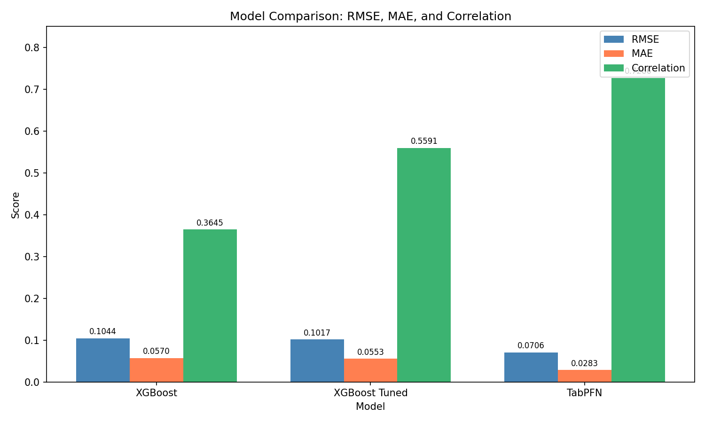

# TabPFN vs. XGBoost for Time Series Forecasting

Comparing a zero-shot tabular foundation model (TabPFN) against XGBoost —
untuned and tuned — on a real-world predictive-maintenance forecasting task:
predicting bearing vibration (RMS) one step ahead using NASA's IMS run-to-
failure sensor dataset.

## Motivation

This project is a hands-on follow-up to
["From Tables to Time: Extending TabPFN-v2 to Time Series Forecasting"](https://arxiv.org/abs/2501.02945)
(Hoo, Müller, Salinas & Hutter, 2025), which introduces **TabPFN-TS**: the
idea that time series forecasting can be reframed as tabular regression by
combining a pretrained tabular foundation model (TabPFN) with lightweight
temporal featurization (calendar features, lag/seasonal encodings), rather
than training a dedicated sequence model.

This repo tests that idea end-to-end on a single real dataset: does a
general-purpose, zero-shot tabular model actually compete with a carefully
tuned gradient-boosted tree baseline once both see the same engineered
temporal features?

## Dataset

[NASA IMS Bearing Dataset](data/README.md), Test 2: a run-to-failure
vibration dataset from 4 bearings on a single shaft, sampled roughly every
10 minutes over ~7 days until bearing 1 suffered an outer-race failure.
Each snapshot is a raw multi-channel vibration signal; see [data/README.md](data/README.md)
for the file layout and how to obtain the data (not included in this repo -
see below).

## Pipeline architecture

```
data/NASA_bearing_datasest/2nd_test/2nd_test/*   (984 raw snapshot files)
              │
              ▼
      preprocess.py    → per-snapshot stats (RMS, peak, kurtosis, skew,
                          std, crest factor) per channel; 981x25 dataframe;
                          target = next snapshot's bearing-1 RMS
              │
              ▼
      features.py      → + running time index
                          + cyclic calendar features (hour/day/month, sin/cos)
                          + FFT-detected seasonal features (top-3 periods)
              │
              ▼
      train.py         → strict time-based 80/20 split (no shuffling)
                          → XGBoost (baseline, default hyperparameters)
                          → XGBoost (tuned via RandomizedSearchCV + TimeSeriesSplit)
                          → TabPFN (zero-shot, no tuning)
              │
              ▼
      evaluate.py      → RMSE, MAE, correlation + actual-vs-predicted plots
```

Each script maps to one stage of the pipeline and can be run independently
or imported as a module; `train.py` orchestrates the full run.

## Key findings

| Model          | RMSE   | MAE    | Correlation |
|----------------|--------|--------|-------------|
| XGBoost        | 0.1044 | 0.0570 | 0.3645      |
| XGBoost Tuned  | 0.1017 | 0.0553 | 0.5591      |
| TabPFN         | 0.0706 | 0.0283 | 0.7266      |

- **TabPFN outperformed tuned XGBoost on every metric with zero tuning.**
  Its correlation (0.73) is roughly 30% higher than tuned XGBoost's (0.56)
  and more than double the untuned baseline's (0.36).
- Untuned XGBoost predicted a near-flat line, largely failing to track the
  rising RMS trend as the bearing degraded.
- A 250-fit `RandomizedSearchCV` walk-forward search meaningfully improved
  XGBoost's correlation (0.36 → 0.56) but still fell well short of TabPFN's
  out-of-the-box performance.
- **Neither model predicted the actual point of failure** (the terminal
  spike in RMS as the bearing gave out) — both underestimated its
  magnitude. TabPFN still handled it comparatively better than either
  XGBoost variant, tracking closer to the true spike instead of missing it
  as badly.
- TabPFN's edge was most consistent on the short-term fluctuations in the
  RMS signal throughout the test period, not just the overall degradation
  trend — XGBoost's predictions were noticeably smoother/flatter and missed
  most of this local variation.
- All three models saw an identical feature set (raw channel statistics +
  calendar features + FFT seasonal features), so the gap reflects the
  models themselves, not feature availability.



## Project structure

```
├── preprocess.py       # raw files -> per-snapshot statistics dataframe
├── features.py         # temporal feature engineering
├── train.py            # train/test split + model training (entry point)
├── evaluate.py         # metrics + plotting
├── requirements.txt
├── data/
│   └── README.md       # dataset description + download instructions
└── notebooks/
    └── analysis.ipynb  # original exploratory notebook (reference only)
```

## Running it

```bash
pip install -r requirements.txt
```

Download the dataset per [data/README.md](data/README.md), then:

```bash
export TABPFN_ACCESS_TOKEN=your_token_here   # get a token at https://ux.priorlabs.ai
python train.py
```

`train.py` runs the full pipeline: preprocessing, feature engineering,
the time-based split, all three models, and prints/plots the evaluation
results shown above.

The original exploratory notebook is kept in [notebooks/analysis.ipynb](notebooks/analysis.ipynb)
for reference; the scripts above are the cleaned-up, reproducible version
of the same logic.
